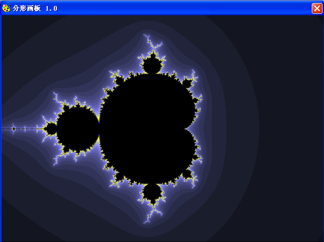

分形画板
========================

早期大一时候写的分形绘图程序，当时仅仅觉得分形好玩，写着玩玩。。代码比较烂，仅供参考学习。。。

### 主要功能

1. 利用逃逸/迭代法绘制Mandelbrot、Julia、Newton集
     - 支持无限局部放大
     - 支持颜色、常数因子等参数设置
     - 支持自定义公式
     - 针对部分常用公式进行加速优化
     
2. 利用LS文法绘制
    - 支持自定义LS文法编辑
    - 支持颜色、常数因子等参数设置
    
3. 绘制数学曲线
   - 支持自定义二元曲线方程绘制
   - 支持自定义二维、三维参数方程绘制曲线
   - 支持颜色、常数因子等参数设置
   - 可自定义调整坐标范围
   
4. IFS仿射变换绘制
   - 自定义IFS码设置
   - 支持颜色、迭代次数、常数因子等参数设置
   - 内置常用IFS码（树、枫叶、Koch/C曲线等等）
   
5. 分形动画
   - 动画效果很一般
   
6. 四元数分形
   - 没来得及实现
   

###Mandelbrot集

